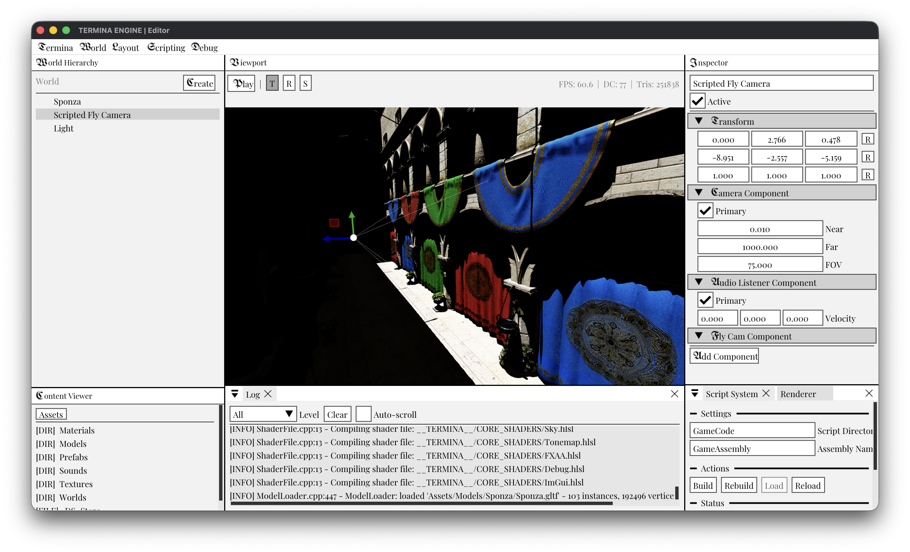

# TERMINA ENGINE : 1 WEEK TO MAKE IT HAPPEN



Termina is a game engine made in about a week.

## Features

- Vulkan/Metal rendering
- macOS/Windows/Linux support
- Audio system with spatialization
- Input system (keyboard, mouse, gamepad)
- C++ scripting with hot-reload
- Automatic shader hot reload
- Actor model and world serialization/deserialization
- Asset system with ref-counting
- Fully fledged editor, launcher, and project system
- Physics system
- Physically based BRDF
- Point/Spot/Directional lights
- Deferred shading
- CPU frustum culling
- Raytraced shadows
- Procedural sky
- FXAA
- Debug renderer
- HDR rendering

## Building

```
xmake
xmake run Editor
```

woaw!

## Dependencies

- cgltf
- DirectX Shader Compiler
- glfw
- GLM
- ImGui
- Jolt
- nlohmann/json
- Metal Shader Converter
- MikkTSpace
- miniaudio
- stb_image
- Vulkan Memory Allocator
- Volk
